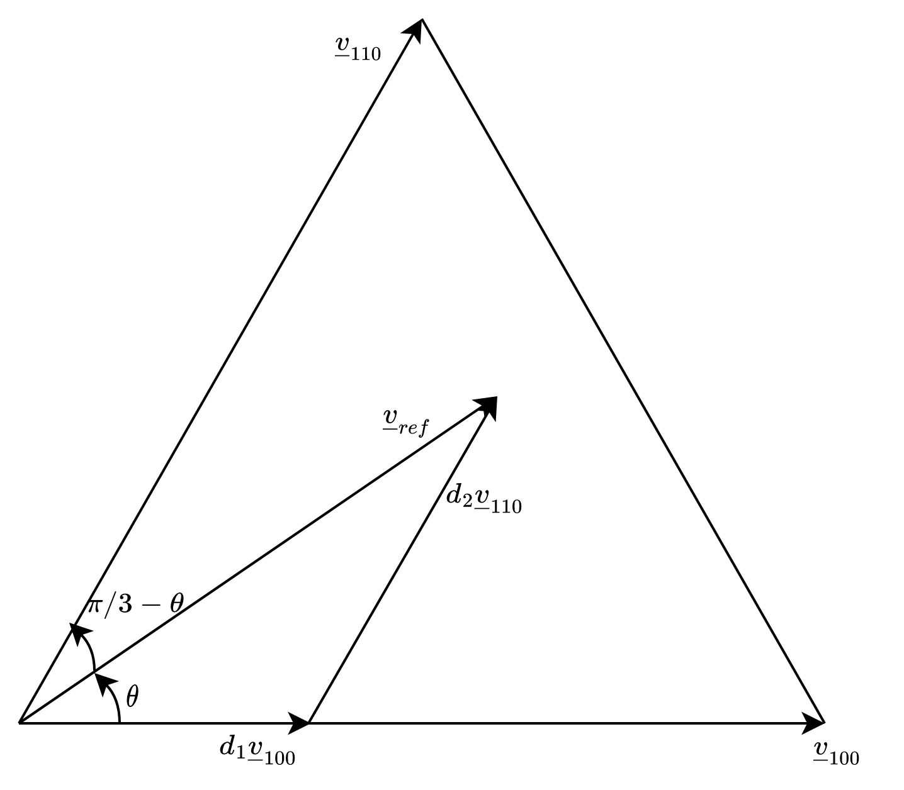

# Modulation


## Vector definition

Two-level modulation has six active vectors and two zero-vectors. Each vector is calculation from the generel voltage vector formula as here below. The volage vector subscript denotes phase a, b, c, 1 for a high voltage and 0 for a low voltage.

$$
\begin{aligned}
\underline{v}_{100} 
& = \frac{2}{3} \left( \frac{V_d}{2} - \frac{V_d}{2} e^{j \frac{2 \pi}{3}}- \frac{V_d}{2} e^{j \frac{4 \pi}{3}} \right)\\
& = \frac{2}{3} \frac{V_d}{2} \left( 1-  (- \frac{1}{2}+j\frac{\sqrt{3}}{2}) - (- \frac{1}{2}-j\frac{\sqrt{3}}{2}) \right)\\
& = \frac{2}{3} \frac{V_d}{2} 2\\
& = \frac{2}{3} V_d\\
\end{aligned}
$$
$$
\begin{aligned}
\underline{v}_{000} &  = 0\\
\underline{v}_{100} &  = \frac{2}{3} V_d\\
\underline{v}_{110} &  = \frac{2}{3} V_d (\frac{1}{2}+j\frac{\sqrt{3}}{2})\\
\underline{v}_{010} &  = \frac{2}{3} V_d (-\frac{1}{2}+j\frac{\sqrt{3}}{2})\\
\underline{v}_{011} &  = -\frac{2}{3} V_d\\
\underline{v}_{001} &  = \frac{2}{3} V_d (-\frac{1}{2}-j\frac{\sqrt{3}}{2})\\
\underline{v}_{101} &  = \frac{2}{3} V_d (\frac{1}{2}-j\frac{\sqrt{3}}{2})\\
\underline{v}_{111} &  = 0\\
\end{aligned}
$$

## Calculation of duty-cycles.

```{r, echo=FALSE, out.width="75%", fig.cap="A sector of the modulation hexagon."}
#knitr::include_graphics("modulation-sector.png")

```


