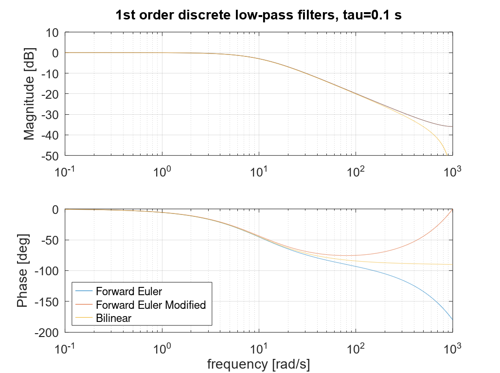
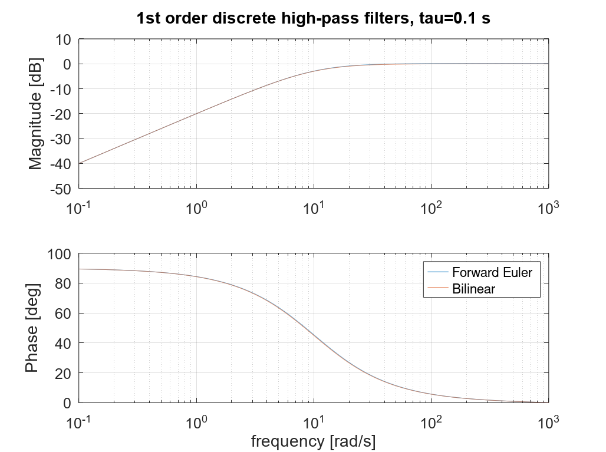
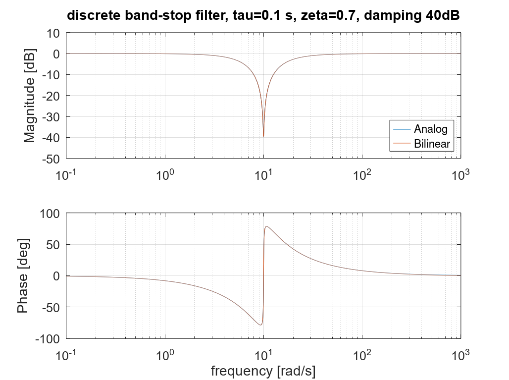

# Filters

This chapter gives an overview of the most used basic filters, such as low-pass, high-pass, band-pass, band-stop, and integrator.

## Nomenclature
s: Laplace operator.  
$\tau$: time-constant.  
$\omega_c$: Filter cut-off frequency (rad/s).  


## Analog Filters

### Low-pass filter 1st order

The transfer function of a 1st order low-pass filter is:
$$
G(s) =  \frac{1}{\tau s + 1} = \frac{\omega_c}{s + \omega_c}
(\#eq:lpf1)
$$
```{r, echo=FALSE, out.width="100%", fig.cap="Bode-plot example of 1st order low-pass filter."}
knitr::include_graphics("images/filters/lpf_1st.png")
```


### High-pass filter 1st order

The transfer function of a 1st order high-pass filter is:
$$
G(s) =  \frac{\tau s}{\tau s + 1} = \frac{s}{s + \omega_c}
(\#eq:hpf1)
$$
```{r, echo=FALSE, out.width="100%", fig.cap="Bode-plot example of 1st order high-pass filter."}

```


### Low-pass filter 2nd order

The transfer function of a 2nd order low-pass filter is:
$$
G(s) =  \frac{1}{(\tau s)^2 + 2\zeta \tau s + 1} = \frac{\omega_c^2}{s^2 + 2\zeta \omega_c s + \omega_c^2}
(\#eq:lpf2)
$$

```{r, echo=FALSE, out.width="100%", fig.cap="Bode-plot example of 2nd order low-pass filter."}

```


### High-pass filter 2nd order

The transfer function of a 2nd order high-pass filter is:
$$
G(s) =  \frac{(\tau s)^2}{(\tau s)^2 + 2\zeta \tau s + 1} = \frac{s^2}{s^2 + 2\zeta \omega_c s + \omega_c^2}
(\#eq:hpf2)
$$

```{r, echo=FALSE, out.width="100%", fig.cap="Bode-plot example of 2nd order high-pass filter."}

```


### Band-pass filter

The transfer function of a band-pass filter is:
$$
G_{bpf}(s) =  \frac{2\zeta \tau s}{(\tau s)^2 + 2\zeta \tau s + 1} = \frac{2\zeta \omega_c s}{s^2 + 2\zeta \omega_c s + \omega_c^2}
(\#eq:bpf)
$$

```{r, echo=FALSE, out.width="100%", fig.cap="Bode-plot example of a band-pass filter."}

```


### Band-stop filter

The transfer function of a band-stop filter (notch filter) is:
$$
G_{bsf}(s) = \frac{(\tau s)^2 + 2\zeta_n \tau s + 1}{(\tau s)^2 + 2\zeta_d \tau s + 1} 
=\frac{s^2 + 2\zeta_n \omega_c s + \omega_c^2}{s^2 + 2\zeta_d \omega_c s + \omega_c^2}
(\#eq:bsf1)
$$
where $\zeta_n$ and $\zeta_d$ denote the nominator and denominator damping-factors.

The gain at the notch-frequency is:
$$
G_{bsf}(j\omega_c) = \frac{\zeta_n }{\zeta_d }
(\#eq:bsf2)
$$
We can choose to reformulate the transfer-function as:
$$
G_{bsf}(s) = \frac{(\tau s)^2 + 2K_{damp}\zeta \tau s + 1}{(\tau s)^2 + 2\zeta \tau s + 1} 
=\frac{s^2 + 2K_{damp}\zeta \omega_c s + \omega_c^2}{s^2 + 2\zeta \omega_c s + \omega_c^2}
(\#eq:bsf1)
$$
where $K_{damp}$ is a damping factor. For example, if we want 100 times (40 dB) damping  at the notch-frequency, we set $K_{damp} = 0.01$.

```{r, echo=FALSE, out.width="100%", fig.cap="Bode-plot example of a band-stop filter."}
knitr::include_graphics("images/filters/bsf.png")
```


### Integrator with Finite dc-gain

An integrator may be used in control schemes, for example to calculate flux by integrating voltage. This may practically be done by combining the integrator with a high-pass filter to avoid an infinite dc-gain, which can cause problems with measurement offset etc.

The transfer function is:

$$
G(s) =  \frac{\tau s}{(\tau s + 1)s} = \frac{\tau}{\tau s + 1}
(\#eq:int1)
$$

```{r, echo=FALSE, out.width="100%", fig.cap="Bode-plot example of an integrator with finite dc-gain."}

```

This implementation will not completely remove a dc-offset, but as in this example, with a -20 dB dc-gain, an offset on the input is reduced with a factor 10 on the output. So if any dc-offset should be completely removed, then one more high-pass filter must be added.


## Digital Filters


### Low-pass filter 1st order

Using the forward Euler discretization:

$$
\begin{aligned}
G(s) &=  \frac{\omega_c}{s + \omega_c}, s=\frac{z-1}{T} \\
G(z) &=  \frac{\omega_c}{\frac{z-1}{T} + \omega_c} = \frac{\omega_c T}{z- (1 - \omega_c T)} 
= \frac{\omega_c T z^{-1}}{1- (1 - \omega_c T)z^{-1}} \\
y(k) &=   (1 - \omega_c T)y(k-1)   + \omega_c T u(k-1) \\
\end{aligned}
(\#eq:dlpf1)
$$

An practical alternative to this is to the newest input sample, instead of using the old one. We call it here the modified forward Euler method:

$$
\begin{aligned}
y(k) &= (1 - \omega_c T)y(k-1)   + \omega_c T u(k) \\
G(z) &=  \frac{\omega_c T z}{z- (1 - \omega_c T)} = \frac{\omega_c T }{1- (1 - \omega_c T)z^{-1}} \\
\end{aligned}
(\#eq:dlpf2)
$$


Bilinear transformation:

$$
\begin{aligned}
G(s) &=  \frac{\omega_c}{s + \omega_c}, s=\frac{2}{T} \frac{z-1}{z+1} \\
G(z) &=  \frac{\omega_c}{\frac{2}{T} \frac{z-1}{z+1} + \omega_c}
= \frac{ \frac{\omega_cT}{2}(z+1)}{ (z-1)+ \frac{\omega_cT}{2} (z+1)} 
= \frac{ \frac{\omega_cT}{2}(z+1)}{  (1+\frac{\omega_cT}{2}) z - (1-\frac{\omega_cT}{2})}  \\
 &=   \frac{ \omega_cT(z+1)}{  (2+\omega_cT) z - (2-\omega_cT)} 
 =  \frac{ \frac{\omega_cT}{2+\omega_cT}(z+1)}{   z - \frac{2-\omega_cT}{2+\omega_cT}}  \\
y(k) &=   \left( \frac{2-\omega_cT}{2+\omega_cT} \right) y(k-1)   + \left( \frac{\omega_cT}{2+\omega_cT} \right)  (u(k)+u(k-1)) \\
\end{aligned}
(\#eq:dlpf3)
$$

```{r, echo=FALSE, out.width="100%", fig.cap="Bode-plot example of discrete 1st order low-pass filters, shown up to the nyquist-frequency."}

```

We see that only the bilinear discretization yields the correct phase at high-frequencies. However, as this is a low-pass filter where typically the important signal is in the pass-region, the simpler forward Euler discretizations are in most cases ok to use.


### High-pass filter 1st order


The 1st order high-pass filter is discretized by forward Euler is:
$$
\begin{aligned}
G(s) &=  \frac{s}{s + \omega_c}, s=\frac{z-1}{T}  \\
&=  \frac{\frac{z-1}{T}}{\frac{z-1}{T} + \omega_c} =\frac{z-1}{z-(1- \omega_c T)} 
=\frac{1-z^{-1}}{1-(1- \omega_c T)z^{-1}}  \\
y(k) &=   (1 - \omega_c T)y(k-1)   +  u(k)-u(k-1) \\
\end{aligned}
(\#eq:dhpf1)
$$

The 1st order high-pass filter is discretized by bilinear methos is:
$$
\begin{aligned}
G(s) &=  \frac{s}{s + \omega_c}, s=\frac{2}{T} \frac{z-1}{z+1}  \\
&=  \frac{\frac{2}{T} \frac{z-1}{z+1}}{\frac{2}{T} \frac{z-1}{z+1} + \omega_c}
=\frac{z-1}{z-1 + \frac{\omega_c T}{2}(z+1) } \\
&=\frac{z-1}{(1+\frac{\omega_c T}{2}) z - (1-\frac{\omega_c T}{2}) }
= \frac{2(z-1)}{(2+\omega_c T) z - (2-\omega_c T) }   \\
&= \frac{ \frac{2}{2+\omega_c T} (z-1)}{ z - \frac{2-\omega_c T}{2+\omega_c T} }  
= \frac{ \frac{2}{2+\omega_c T} (1-z^{-1})}{ 1 - \frac{2-\omega_c T}{2+\omega_c T}z^{-1} }  \\
y(k) &=   \frac{2-\omega_c T}{2+\omega_c T}y(k-1)   + \frac{2}{2+\omega_c T}  (u(k)-u(k-1)) \\
\end{aligned}
(\#eq:dhpf2)
$$


```{r, echo=FALSE, out.width="100%", fig.cap="Bode-plot example of discrete 1st order high-pass filters, shown up to the nyquist-frequency."}

```


### Band-pass filter

For a band-pass filter it is important with an accurate phase and pass-frequency, and therefore it is discretized with the bilinear method, and with prewarping to hit the correct frequency:

$$
\begin{aligned}
G_{bpf}(s) &=  \frac{2\zeta \omega_0 s}{s^2 + 2\zeta \omega_0 s + \omega_0^2}, s=\frac{\omega_0}{\tan(\omega_0 T/2)} \frac{z-1}{z+1} =\frac{\omega_0}{K} \frac{z-1}{z+1} \\
K &= \tan(\omega_0 T/2) \\
G_{bpf}(z) &=  \frac{2\zeta \omega_0 (\frac{\omega_0}{K} \frac{z-1}{z+1})}{(\frac{\omega_0}{K} \frac{z-1}{z+1})^2 + 2\zeta \omega_0 (\frac{\omega_0}{K} \frac{z-1}{z+1}) + \omega_0^2} \\
&=  \frac{2\zeta K  (z-1)(z+1)}{ (z-1)^2 + 2\zeta K (z-1)(z+1) + K^2(z+1)^2} \\
&=  \frac{2\zeta K  (z^2-1)}{ z^2-2z+1 + 2\zeta K (z^2-1) + K^2(z^2+2z+1)} \\
&=  \frac{2\zeta K  (z^2-1)}{ (K^2+2\zeta K+1)z^2 +  2(K^2-1)z + (K^2-2\zeta K+1)  } \\
&=  \frac{ \frac{2\zeta K}{K^2+2\zeta K+1}  (1-z^{-2})}{ 1 +  \frac{2(K^2-1)}{K^2+2\zeta K+1}z^{-1} + \frac{K^2-2\zeta K+1}{K^2+2\zeta K+1}z^{-2}  } \\
\end{aligned}
(\#eq:dbpf1)
$$

$$
\begin{aligned}
G_{bsf}(z) &= \frac{b_0+b_1z^{-1}+b_2z^{-2}}{1+a_1z^{-1}+a_2z^{-2}} \\
K &= \tan(\omega_0 T/2) \\
divisor &= K^2+2\zeta K+1\\
b_0 &=  2\zeta K/divisor\\
b_1 &=  0\\
b_2 &=  2\zeta K/divisor\\
a_1 &=  2(K^2-1)/divisor\\
a_2 &=  (K^2-2\zeta K+1)/divisor\\
y(k) &= -a_1y(k-1) -a_2 y(k-2) + b_0u(k)+ b_1u(k-1)+ b_2u(k-2) \\
\end{aligned}
(\#eq:dbpf2)
$$

From the figure below we see that the discrete filter fit well with the analog filter, except near the Nyquist-frequency, where the phase diverges.

```{r, echo=FALSE, out.width="100%", fig.cap="Bode-plot example of discrete band-pass filter, shown up to the nyquist-frequency."}
knitr::include_graphics("images/filters/bpf_disc.png")
```


### Band-stop filter

For a band-pass filter, like for the band-pass filter above, it is important with an accurate phase and pass-frequency, and therefore it is discretized with the bilinear method, and with prewarping to hit the correct frequency:

$$
\begin{aligned}
G_{bsf}(s) &=  \frac{s^2 + 2K_ {damp}\zeta \omega_0 s + \omega_0^2}{s^2 + 2\zeta \omega_0 s + \omega_0^2}
, s=\frac{\omega_0}{\tan(\omega_0 T/2)} \frac{z-1}{z+1} =\frac{\omega_0}{K} \frac{z-1}{z+1} \\
K &= \tan(\omega_0 T/2) \\
G_{bsf}(z) &=  \frac{(\frac{\omega_0}{K} \frac{z-1}{z+1})^2 + 2K_ {damp}\zeta \omega_0 (\frac{\omega_0}{K} \frac{z-1}{z+1}) + \omega_0^2}{(\frac{\omega_0}{K} \frac{z-1}{z+1})^2 + 2\zeta \omega_0 (\frac{\omega_0}{K} \frac{z-1}{z+1}) + \omega_0^2} \\
&=  \frac{ (z-1)^2 + 2K_ {damp}\zeta K (z-1)(z+1) + K^2(z+1)^2}{ (z-1)^2 + 2\zeta K (z-1)(z+1) + K^2(z+1)^2} \\
&=  \frac{z^2-2z+1 + 2K_ {damp}\zeta K (z^2-1) + K^2(z^2+2z+1)}{ z^2-2z+1 + 2\zeta K (z^2-1) + K^2(z^2+2z+1)} \\
&=  \frac{ (K^2+2K_ {damp}\zeta K+1)z^2 +  2(K^2-1)z + (K^2-2K_ {damp}\zeta K+1)}{ (K^2+2\zeta K+1)z^2 +  2(K^2-1)z + (K^2-2\zeta K+1)  } \\
&=  \frac{  \frac{K^2+2K_ {damp}\zeta K+1}{K^2+2\zeta K+1} +  \frac{2(K^2-1)}{K^2+2\zeta K+1}z^{-1} + \frac{K^2-2K_ {damp}\zeta K+1}{K^2+2\zeta K+1}z^{-2} }{ 1 +  \frac{2(K^2-1)}{K^2+2\zeta K+1}z^{-1} + \frac{K^2-2\zeta K+1}{K^2+2\zeta K+1}z^{-2}  } \\
\end{aligned}
(\#eq:dbsf1)
$$


$$
\begin{aligned}
G_{bsf}(z) &= \frac{b_0+b_1z^{-1}+b_2z^{-2}}{1+a_1z^{-1}+a_2z^{-2}} \\
K &= \tan(\omega_0 T/2) \\
divisor &= K^2+2\zeta K+1\\
b_0 &=  (K^2+2K_ {damp}\zeta K+1)/divisor\\
b_1 &=  2(K^2-1)/divisor\\
b_2 &=  (K^2-2K_ {damp}\zeta K+1)/divisor\\
a_1 &=  2(K^2-1)/divisor\\
a_2 &=  (K^2-2\zeta K+1)/divisor\\
y(k) &= -a_1y(k-1) -a_2 y(k-2) + b_0u(k)+ b_1u(k-1)+ b_2u(k-2) \\
\end{aligned}
(\#eq:dbsf2)
$$

```{r, echo=FALSE, out.width="100%", fig.cap="Bode-plot example of discrete stop-pass filter, shown up to the nyquist-frequency."}

```


<!--
$$
\begin{aligned}
v_\alpha &=   v_a\\
v_\beta &=  \frac{1}{\sqrt{3}} (v_b-v_c) \\
\end{aligned}
(\#eq:abcAB2)
$$
-->


