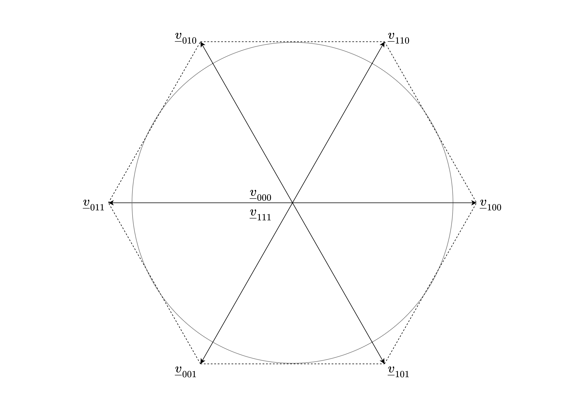
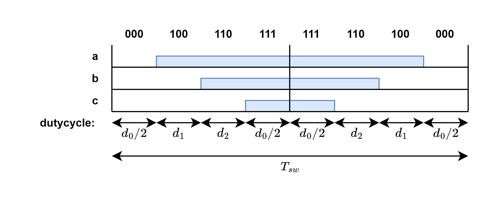
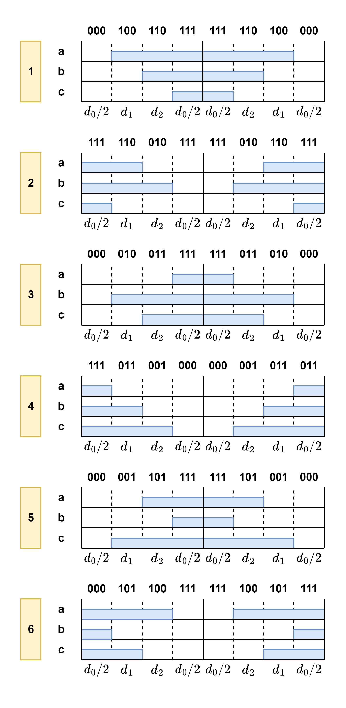
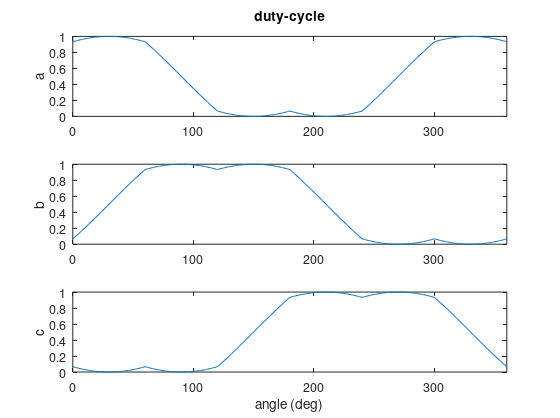
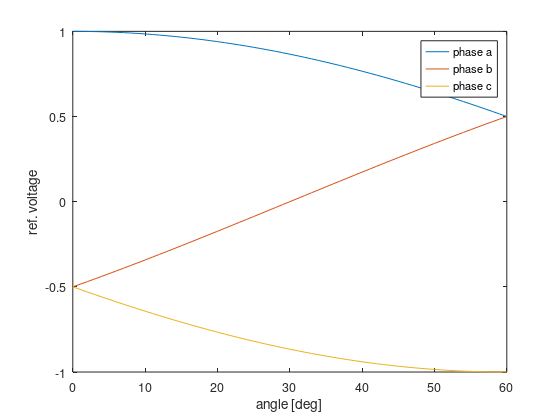

# Modulation

The modulation described here is based on space-vectors.


## Two-Level Space Vectors

Two-level modulation has six active vectors and two zero-vectors. Each vector is calculated from the general voltage vector formula as here below. The voltage vector subscript denotes the switch level for phases a, b and c, where 1 means the voltage is clamped to high rail of the dc-link voltage and 0 means the voltage is clamped to the low rail.

$$
\begin{aligned}
\underline{v}_{100} 
& = \frac{2}{3} \left( \frac{V_d}{2} - \frac{V_d}{2} e^{j \frac{2 \pi}{3}}- \frac{V_d}{2} e^{j \frac{4 \pi}{3}} \right)\\
& = \frac{2}{3} \frac{V_d}{2} \left( 1-  (- \frac{1}{2}+j\frac{\sqrt{3}}{2}) - (- \frac{1}{2}-j\frac{\sqrt{3}}{2}) \right)\\
& = \frac{2}{3} \frac{V_d}{2} 2\\
& = \frac{2}{3} V_d\\
\end{aligned}
$$

```{r, echo=FALSE, out.width="100%", fig.cap="Hexagon with the six active vectors and two zero vector."}

```


Similarly, all the vectors are derived as:

$$
\begin{aligned}
\underline{v}_{000} &  = 0\\
\underline{v}_{100} &  = \frac{2}{3} V_d\\
\underline{v}_{110} &  = \frac{2}{3} V_d (\frac{1}{2}+j\frac{\sqrt{3}}{2})\\
\underline{v}_{010} &  = \frac{2}{3} V_d (-\frac{1}{2}+j\frac{\sqrt{3}}{2})\\
\underline{v}_{011} &  = -\frac{2}{3} V_d\\
\underline{v}_{001} &  = \frac{2}{3} V_d (-\frac{1}{2}-j\frac{\sqrt{3}}{2})\\
\underline{v}_{101} &  = \frac{2}{3} V_d (\frac{1}{2}-j\frac{\sqrt{3}}{2})\\
\underline{v}_{111} &  = 0\\
\end{aligned}
$$


## Calculation of duty-cycles.

It is possible realize a voltage vector anywhere inside the hexagon on the figure above. Any reference voltage will be located in one of the six sectors, and as it generally desired to avoid unnecessary switching, the reference vector will be realized with the two neighboring active vectors and zero-vectors by geometrical considerations.

```{r, echo=FALSE, out.width="75%", fig.cap="A sector of the modulation hexagon."}
knitr::include_graphics("images/modulation/modulation-sector.png")
```

The duty-cycles are calculated here, from sector 1 on the figure above.

$$
\begin{aligned}
\underline{v}_{ref} &  = d_1 \underline{v}_{100} + d_2 \underline{v}_{110}\\
 &  = d_1 \frac{2}{3} V_d  + d_2 \frac{2}{3} V_d (\frac{1}{2}+j\frac{\sqrt{3}}{2})\\
 &  = \frac{2}{3} V_d ( d_1   + d_2  (\frac{1}{2}+j\frac{\sqrt{3}}{2}))\\
 &  = \frac{2}{3} V_d ( (d_1   + d_2  \frac{1}{2})+jd_2\frac{\sqrt{3}}{2})\\
\end{aligned}
$$
Splitting into real and imaginary parts, we get from the imaginary part:

$$
\begin{aligned}
 | \underline{v}_{ref}| \sin\theta  &  = \frac{2}{3} V_d d_2 \frac{\sqrt{3}}{2}\\
\Rightarrow | \underline{v}_{ref}| \sin\theta  &  = \frac{2}{3} V_d d_2 \frac{\sqrt{3}}{2}\\
\Rightarrow d_2  &  =  \frac{|\underline{v}_{ref}|}{V_d/\sqrt{3}} \sin\theta \\
\end{aligned}
$$
And from the real part:
$$
\begin{aligned}
| \underline{v}_{ref}| \cos\theta &  = \frac{2}{3} V_d ( d_1   + d_2  \frac{1}{2})\\
\Rightarrow  d_1  &  =  \frac{3}{2} \frac{|\underline{v}_{ref}|}{V_d}   \cos\theta  - \frac{1}{2}d_2\\
\Rightarrow  d_1  &  =  \frac{\sqrt{3}}{2} \frac{|\underline{v}_{ref}|}{V_d/\sqrt{3}}   \cos\theta  - \frac{1}{2}d_2\\
\end{aligned}
$$
The modulation index is defined as $m_i=|\underline{v}_{ref}|/(V_d/\sqrt{3})$, so the duty-cycles can be formulated as:

$$
\begin{aligned}
d_2  &  =  m_i \sin\theta \\
d_1  &  =  \frac{\sqrt{3}}{2} m_i   \cos\theta  - \frac{1}{2}d_2\\
\end{aligned}
$$
Instead of projecting on the real and imaginary axes, we can make a projection onto the axis perpendicular to $v_{110}$:

$$
\begin{aligned}
d_1|\underline{v}_{110}| \frac{\sqrt{3}}{2}  &  =  |\underline{v}_{ref}|\sin(\frac{\pi}{3}-\theta)  \\
\Rightarrow d_1 \frac{2}{3} V_d  \frac{\sqrt{3}}{2}  &  =  |\underline{v}_{ref}|\sin(\frac{\pi}{3}-\theta)\\
\Rightarrow d_1   &  =  \frac{|\underline{v}_{ref}|}{V_d/\sqrt{3}}  \sin(\frac{\pi}{3}-\theta)\\
\Rightarrow d_1   &  =  m_i  \sin(\frac{\pi}{3}-\theta)\\
\end{aligned}
$$

This way the duty-cycles can be calculated as:
$$
\begin{aligned}
d_1   &  =  m_i  \sin(\frac{\pi}{3}-\theta)\\
d_2  &  =  m_i \sin\theta \\
\end{aligned}
$$

Furthermore, the zero-vector dutycycle is:
$$
d_0 = 1 - d_1 - d_2
$$

## Space Vector Modulation (SVM).

In space vector modulation the active vectors are placed in the middle and the zero-vectors are evenly placed in the beginning and the end. An example is shown here:

```{r, echo=FALSE, out.width="100%", fig.cap="Pwm pulses over one switching period for sector 1 with spacevector modulation."}

```


```{r, echo=FALSE, out.width="100%", fig.cap="Spacevector modulation pulses for all six sectors."}

```

The duty-cycles for phases a, b and c are calculated as:

$$
\begin{aligned}
\text{sector 1}&\\
d_a  &  =  d_0/2 + d_2+d_1\\
d_b  &  =  d_0/2 + d_2\\
d_c  &  =  d_0/2\\
\text{sector 2}&\\
d_a  &  =  d_0/2 + d_1\\
d_b  &  =  d_0/2 + d_1+d_2\\
d_c  &  =  d_0/2\\
\text{sector 3}&\\
d_a  &  =  d_0/2 \\
d_b  &  =  d_0/2 + d_2+d_1\\
d_c  &  =  d_0/2 + d_2\\
\text{sector 4}&\\
d_a  &  =  d_0/2\\
d_b  &  =  d_0/2 + d_1\\
d_c  &  =  d_0/2 + d_1+d_2\\
\text{sector 5}&\\
d_a  &  =  d_0/2 + d_2\\
d_b  &  =  d_0/2\\
d_c  &  =  d_0/2 + d_2+d_1\\
\text{sector 6}&\\
d_a  &  =  d_0/2 + d_1+d_2\\
d_b  &  =  d_0/2\\
d_c  &  =  d_0/2 + d_1\\
\end{aligned}
$$

```{r, echo=FALSE, out.width="100%", fig.cap="Spacevector modulation duty-cycle for phase a, b, and c, for modulation index = 1."}

```

## Duty-cycle function expression.

The duty-cycles are reformulated for sector 1, by inserting $d_0 = 1-d_1-d_2$ in the expression above:

$$
\begin{aligned}
d_a  &  = \frac{1}{2} (1+ d_1+d_2)\\
d_b  &  = \frac{1}{2} (1- d_1+d_2)\\
d_c  &  = \frac{1}{2} (1- d_1-d_2)\\
\end{aligned}
$$

For sector 1 we get:

$$
\begin{aligned}
d_a  &  = \frac{1}{2} (1+ d_1+d_2)\\
&  =  \frac{1}{2} (1+ (\frac{\sqrt{3}}{2} m_i   \cos\theta  - \frac{1}{2}d_2)+d_2) \\
&  =  \frac{1}{2} (1+ \frac{\sqrt{3}}{2} m_i   \cos\theta  + \frac{1}{2} m_i \sin\theta ) \\
&  =  \frac{1}{2} + \frac{1}{2} m_i( \frac{\sqrt{3}}{2}  \cos\theta  + \frac{1}{2} \sin\theta ) \\
\end{aligned}
$$

$$
\begin{aligned}
d_b  &  = \frac{1}{2} (1- d_1+d_2)\\
&  =  \frac{1}{2} (1- (\frac{\sqrt{3}}{2} m_i   \cos\theta  - \frac{1}{2}d_2)+d_2) \\
&  =  \frac{1}{2} (1- \frac{\sqrt{3}}{2} m_i   \cos\theta  + \frac{3}{2} m_i \sin\theta ) \\
&  =  \frac{1}{2} - \frac{1}{2} m_i( \frac{\sqrt{3}}{2}  \cos\theta  - \frac{3}{2} \sin\theta ) \\
\end{aligned}
$$


$$
\begin{aligned}
d_c  &  = \frac{1}{2} (1- d_1-d_2)\\
&  =  \frac{1}{2} (1- (\frac{\sqrt{3}}{2} m_i   \cos\theta  - \frac{1}{2}d_2)-d_2) \\
&  =  \frac{1}{2} (1- \frac{\sqrt{3}}{2} m_i   \cos\theta  - \frac{1}{2} m_i \sin\theta ) \\
&  =  \frac{1}{2} - \frac{1}{2} m_i( \frac{\sqrt{3}}{2}  \cos\theta  + \frac{1}{2} \sin\theta ) \\
\end{aligned}
$$

## Calculation of duty-cycle from phase-voltage references.

As an alternative to calculate the duty-cycles from the space-vector, they can be calculated from the phase-voltage references directly.

$$
\begin{aligned}
d_a  & = \frac{1}{2} \left( \frac{(v_{ref,a} - v_{cm})}{V_d/2} +1 \right) = \frac{1}{2} +\frac{1}{V_d}  (v_{ref,a} - v_{cm}) \\
d_b  & = \frac{1}{2} \left( \frac{(v_{ref,b} - v_{cm})}{V_d/2} +1 \right) = \frac{1}{2} +\frac{1}{V_d}  (v_{ref,b} - v_{cm}) \\
d_c  & = \frac{1}{2} \left( \frac{(v_{ref,c} - v_{cm})}{V_d/2} +1 \right) = \frac{1}{2} +\frac{1}{V_d}  (v_{ref,c} - v_{cm}) \\
\end{aligned}
$$
where:
$v_{ref,a}$: reference voltage, phase a, phase-zero voltage.  
$v_{ref,b}$: reference voltage, phase b, phase-zero voltage.  
$v_{ref,c}$: reference voltage, phase c, phase-zero voltage.  
$v_{cm}$: common-mode voltage.  
$V_d$: Dc-link voltage.  
$d_a$: duty-cycle, phase a, range 0-1.  
$d_b$: duty-cycle, phase b, range 0-1.  
$d_c$: duty-cycle, phase c, range 0-1.  

The common-mode voltage can have any shape, and space-vector modulation is achieved with this common-mode signal, which is the mean value of the max and min phase voltage references:

$$
\begin{aligned}
v_{cm}  &  = \frac{1}{2}  ( \text{min}(v_a, v_b, v_c) + \text{max}(v_a, v_b, v_c))\\
\end{aligned}
$$

We can now show that this does give the same result as the previously derived expressions. As an example of this, we calculate the duty-cycle for phase a in sector 1. From the figure below we can see that phase a is the highest and phase c the lowest.

```{r, echo=FALSE, out.width="75%", fig.cap="Voltage references for phase a, b, and c."}

```


$$
\begin{aligned}
v_a-v_{cm}  & = |\underline{v}_{ref}| \left( \cos{\theta} - \frac{1}{2}(\cos{\theta}  + \cos{(\theta - 4\pi/3)})  \right)\\
& = |\underline{v}_{ref}| \left( \cos{\theta} - \frac{1}{2}(\cos{\theta}  + \cos{(4\pi/3)}\cos{\theta}+\sin{( 4\pi/3)}\sin{\theta})  \right)\\
& = |\underline{v}_{ref}| \left( \cos{\theta} - \frac{1}{2}(\cos{\theta}  - \frac{1}{2}\cos{\theta} - \frac{\sqrt{3}}{2}\sin{\theta})  \right)\\
& = |\underline{v}_{ref}| ( \frac{3}{4} \cos{\theta}  + \frac{\sqrt{3}}{4}\sin{\theta}  )\\
\end{aligned}
$$

Now the duty-cycle can be derived as:

$$
\begin{aligned}
d_a  & = \frac{1}{2} +\frac{1}{V_d}  (v_{ref,a} - v_{cm}) \\
  & = \frac{1}{2} +\frac{1}{V_d}  |\underline{v}_{ref}| ( \frac{3}{4} \cos{\theta}  + \frac{\sqrt{3}}{4}\sin{\theta}  ) \\
  & = \frac{1}{2} + \frac{1}{2} \frac{|\underline{v}_{ref}|}{V_d/\sqrt{3}} ( \frac{\sqrt{3}}{2} \cos{\theta}  + \frac{1}{2}\sin{\theta}  ) \\
& = \frac{1}{2} +  \frac{1}{2} m_i  ( \frac{\sqrt{3}}{2} \cos{\theta}  + \frac{1}{2}\sin{\theta}  ) \\
\end{aligned}
$$
In the similar way, the expression can be derived for the other phases and other sectors.


