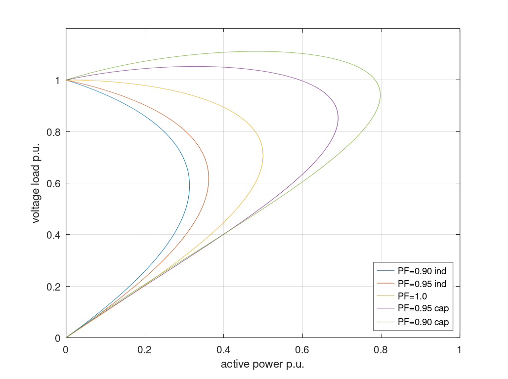

# Power Systems Voltage Stability

This section shows P-V and Q-V curves for a simple ideal reactive transmissions system.


## Nomenclature
$\underline{E}$: Supply Voltage.  
$\underline{V}$: Consumer Voltage.  
$\delta$: load angle, from $\underline{V}$ to $\underline{E}$.

## Transmissions system

<!--
```{r, echo=FALSE, out.width="100%", fig.cap="Simple reactive transmissions system."}
knitr::include_graphics("images/modulation/hexagon.png")
```
-->

The power to the load can be calculated as

$$
\begin{aligned}
S &= P +j Q = \underline{V} \underline{I}^* = V \underline{I}^* \\
&= V \left( \frac{E \angle\delta-V}{jX} \right)^*  \\
&= V \left( \frac{ E \cos \delta - V + jE \sin  \delta }{jX} \right)^*  \\
&= V \left( \frac{  E \sin  \delta }{X} -j \frac{ E \cos \delta - V  \delta }{X} \right)^*  \\
&=  \frac{  VE \sin  \delta }{X} +j \frac{ VE \cos \delta - V^2  }{X}   \\
\end{aligned}
(\#eq:PV1)
$$
So the active and reactive powers are calculated given by:

$$
\begin{aligned}
P &=  \frac{  VE \sin  \delta }{X}   \\
Q &=  \frac{ VE \cos \delta  }{X} - \frac{V^2  }{X}   \\
\end{aligned}
(\#eq:PV2)
$$

We can now eliminate the power angle, and find the correlation between powers and voltages:

$$
\begin{aligned}
&  \sin^2\delta + \cos^2\delta = 1 \\
\Rightarrow &   \left( \frac{PX}{VE} \right)^2 + \left( \frac{QX+V^2}{VE} \right)^2 = 1 \\
\Rightarrow &   \left( \frac{PX}{E^2} \right)^2 + \left( \frac{QX}{E^2} + \frac{V^2}{E^2} \right)^2 = \frac{V^2}{E^2} \\
\Rightarrow & \left( \frac{V^2}{E^2} \right)^2+ \left(2\frac{QX}{E^2} -1 \right) \left(  \frac{V^2}{E^2} \right) + \left( \frac{PX}{E^2} \right)^2 + \left( \frac{QX}{E^2} \right)^2 = 0 \\
\end{aligned}
(\#eq:PV2)
$$
This can be solved as 2nd order equation:
$$
\begin{aligned}
\Rightarrow & \left( \frac{V^2}{E^2} \right)^2+ \left(2\frac{QX}{E^2} -1 \right) \left(  \frac{V^2}{E^2} \right) + \left( \frac{PX}{E^2} \right)^2 + \left( \frac{QX}{E^2} \right)^2 = 0 \\
\Rightarrow & \frac{V^2}{E^2}  = \frac{-\left(2\frac{QX}{E^2} -1 \right) \pm \sqrt{\left(2\frac{QX}{E^2} -1 \right)^2-
4 \left( \left( \frac{PX}{E^2} \right)^2 + \left( \frac{QX}{E^2} \right)^2 \right)}  }{2}   \\
\Rightarrow & \frac{V^2}{E^2}  =  \frac{1}{2}- \frac{QX}{E^2}  \pm \sqrt{\left(\frac{QX}{E^2} -\frac{1}{2} \right)^2-
  \left( \frac{PX}{E^2} \right)^2 - \left( \frac{QX}{E^2} \right)^2 }    \\
\Rightarrow & \frac{V^2}{E^2}  =  \frac{1}{2}- \frac{QX}{E^2}  \pm \sqrt{ \frac{1}{4} -
  \left( \frac{PX}{E^2} \right)^2 + \frac{QX}{E^2}  }    \\
\Rightarrow & \frac{V}{E}  = \pm \sqrt{  \frac{1}{2}- \frac{QX}{E^2}  \pm \sqrt{ \frac{1}{4} -
  \left( \frac{PX}{E^2} \right)^2 - \frac{QX}{E^2}  } }  \\
\end{aligned}
(\#eq:PV2)
$$

We can also express this in per-unit values, using the following base values:
$$
\begin{aligned}
V_{base} =E, \quad S_{base} = \frac{E^2}{X}
\end{aligned}
(\#eq:PV3)
$$
$$
\begin{aligned}
v_{pu}  &= \sqrt{  \frac{1}{2}- q_{pu}  \pm \sqrt{ \frac{1}{4} -
  p_{pu}^2 - q_{pu}  } }   \\
\end{aligned}
(\#eq:PV4)
$$
In order to make a P-V diagram for constant power-factor, q will be expressed as:
$$
q = p  \tan \varphi 
(\#eq:PV5)
$$
$$
\begin{aligned}
v_{pu}  &= \sqrt{  \frac{1}{2}- p_{pu} \tan \varphi  \pm \sqrt{ \frac{1}{4} -
  p_{pu}^2 - p_{pu} \tan \varphi  } }   \\
\end{aligned}
(\#eq:PV6)
$$
This expression can by used to plot the p-v curves on the figure below.

```{r, echo=FALSE, out.width="100%", fig.cap="P-V diagram."}

```


